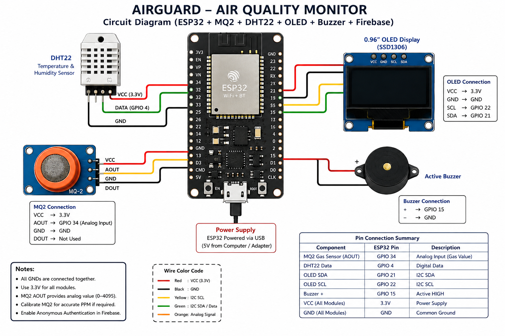
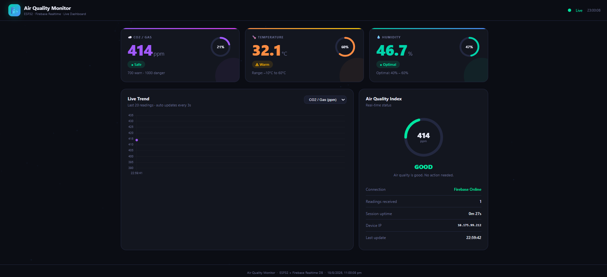

# 🌿 AIRGUARD — IoT-Based Air Quality Monitoring System

> **AIRGUARD** is an IoT-based air quality monitoring system designed to detect gas and smoke levels while monitoring environmental conditions such as temperature and humidity in real time.

---

## 📌 Overview

AIRGUARD is built using an **ESP32 microcontroller**, **MQ-2 Gas Sensor**, **DHT22 Temperature & Humidity Sensor**, **OLED Display**, and **Buzzer**.

The system continuously monitors:

* 🌫️ Gas and smoke levels
* 🌡️ Temperature
* 💧 Humidity

Sensor readings are displayed locally on an OLED screen and transmitted to **Firebase Realtime Database** using Wi-Fi.

When the detected gas level exceeds predefined thresholds, AIRGUARD automatically activates alerts and displays the current safety status as:

* 🟢 **SAFE**
* ⚠️ **WARNING**
* 🚨 **DANGER**

---

## ✨ Features

* 🌫️ Real-time gas and smoke monitoring using the **MQ-2 sensor**
* 🌡️ Temperature monitoring using **DHT22**
* 💧 Humidity monitoring using **DHT22**
* 🖥️ Real-time data display on a **0.96" SSD1306 OLED**
* 🔔 Automatic buzzer alerts for unsafe gas levels
* 🚦 Three-level safety status: **SAFE / WARNING / DANGER**
* ☁️ Firebase Realtime Database integration
* 📶 Wi-Fi connectivity
* 🔄 Automatic Wi-Fi reconnection
* 📴 Offline monitoring support
* 📊 Real-time sensor data updates

---

## 🛠️ Hardware & Technologies

### Hardware Components

| Component    | Description                         |
| ------------ | ----------------------------------- |
| ESP32        | Main microcontroller                |
| MQ-2         | Gas and smoke detection             |
| DHT22        | Temperature and humidity monitoring |
| SSD1306 OLED | Real-time display                   |
| Buzzer       | Audio alert system                  |

### Software & Technologies

* Arduino C++
* Arduino IDE
* Firebase Realtime Database
* Wi-Fi
* ESP32 Arduino Core

---

## 🔌 Circuit Diagram



---

## 📍 Pin Connections

| Component  | ESP32 Pin |
| ---------- | --------- |
| MQ-2 AOUT  | GPIO 34   |
| DHT22 DATA | GPIO 4    |
| OLED SDA   | GPIO 21   |
| OLED SCL   | GPIO 22   |
| Buzzer     | GPIO 15   |

---

## 📚 Required Libraries

Install the following libraries using:

**Arduino IDE → Library Manager**

* Firebase ESP Client
* DHT sensor library
* Adafruit GFX Library
* Adafruit SSD1306

The ESP32 Arduino Core provides support for:

* `WiFi.h`
* `Wire.h`

---

## ⚙️ Installation & Setup

### 1️⃣ Clone the Repository

```bash
git clone https://github.com/gadakarisiddhik/Air-Quality-Monitor-AIRGUARD-.git
```

Navigate to the project directory:

```bash
cd Air-Quality-Monitor-AIRGUARD-
```

---

### 2️⃣ Install ESP32 Board Support

Open **Arduino IDE** and install the **ESP32 Arduino Core**.

Then select your ESP32 board from:

```text
Tools → Board → ESP32
```

---

### 3️⃣ Install Required Libraries

Install all required libraries listed in the **Required Libraries** section using the Arduino IDE Library Manager.

---

### 4️⃣ Configure Wi-Fi

Open:

```text
air_quality_monitor.ino
```

Replace the Wi-Fi credentials with your own:

```cpp
#define WIFI_SSID     "YOUR_WIFI_NAME"
#define WIFI_PASSWORD "YOUR_WIFI_PASSWORD"
```

Example:

```cpp
#define WIFI_SSID     "MyWiFi"
#define WIFI_PASSWORD "MyPassword"
```

> ⚠️ Never upload your real Wi-Fi password or Firebase credentials to a public GitHub repository.

---

### 5️⃣ Configure Firebase

Update your Firebase configuration inside:

```text
air_quality_monitor.ino
```

Add your Firebase project credentials before uploading the code to the ESP32.

---

### 6️⃣ Upload the Code

1. Connect your ESP32 board to your computer.
2. Select the correct **Board** and **COM Port**.
3. Open `air_quality_monitor.ino`.
4. Click **Upload** in the Arduino IDE.

---

## 🚦 System Workflow

```text
Sensors
   │
   ▼
ESP32 Microcontroller
   │
   ├── Read MQ-2 Gas Level
   ├── Read Temperature
   └── Read Humidity
   │
   ▼
Determine Safety Status
   │
   ├── SAFE
   ├── WARNING
   └── DANGER
   │
   ├──────────────► OLED Display
   │
   ├──────────────► Buzzer Alert
   │
   └──────────────► Firebase Realtime Database
```

---

## 📊 Dashboard

The AIRGUARD dashboard provides a simple interface for monitoring sensor readings and system status in real time.



---

## 📂 Project Structure

```text
AIRGUARD/
│
├── air_quality_monitor.ino
│
├── images/
│   ├── circuit.png
│   └── dashboard.png
│
├── templates/
│   └── air_quality_dashboard.html
│
├── requirements.txt
│
└── README.md
```

---

## 🔮 Future Improvements

* 📱 Mobile application integration
* 📧 Email and SMS alerts
* 📈 Historical data visualization
* 🤖 AI-based air quality prediction
* 🌍 Multiple sensor monitoring
* 🔔 Push notifications
* 📊 Advanced analytics dashboard

---

## 👨‍💻 Author

**Siddhik Gadakari**

* GitHub: `gadakarisiddhik`

---

## 📄 License

This project is created for **educational and learning purposes**.

---

### ⭐ Support

If you found this project useful, consider giving the repository a **star ⭐**!

**AIRGUARD — Monitor the Air. Protect What Matters. 🌿**
